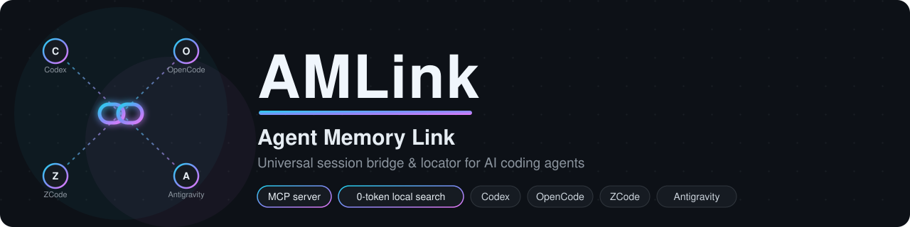

<p align="center">
  
</p>

# AMLink — Agent Memory Link

**A local MCP server that lets any AI coding agent instantly find and resume a session created in another agent.**

You work across several coding harnesses — **Google Antigravity, OpenCode, ZCode, OpenAI Codex** — and when you hit a rate limit on one, you switch to another and keep going. The catch: every harness stores its sessions in its own corner of the disk (SQLite, JSONL, protobuf…), so the new agent starts blindly running `find` / `grep` / recursive scans just to *locate the session file* — burning time and tokens before any real work happens.

AMLink kills that step. A local MCP server indexes all your harnesses' sessions **read-only, with zero LLM tokens**, and injects a compact, ready-to-resume payload straight into the new agent's context.

```
┌─────────────┐   "resume the Codex session 'audit paywalls'"
│ Receiving   │ ─────────────┐
│ agent       │              ▼
│ (ZCode, …)  │   locate_and_load_session()          ┌────────────────────────────┐
└─────────────┘   100% local search                  │  Read-only index           │
      ▲           SQLite / JSONL / protobuf          │  ~/.codex     (state db)   │
      │                                              │  ~/.local/...  opencode.db │
      └──────────── compact Markdown/YAML ◀──────────│  ~/.zcode     (db.sqlite)  │
        payload (objective, files,                   │  ~/.gemini    (brain/)     │
        recent turns, next step)                     └────────────────────────────┘
```

## Highlights

- 🔌 **One server, four harnesses** — Codex, OpenCode, ZCode, Antigravity adapters out of the box
- 🪙 **0-token search** — everything is indexed locally (native SQLite/JSONL parsing, no LLM calls, no `find`/`grep`)
- 🎯 **Find sessions any way you remember them** — session ID (partial works), exact/fuzzy title, project, or `latest`
- 📦 **Compact resume payload** — objective, last exchanges, files touched, todos, and the last agent message — with hard size caps per section
- 🧹 **Noise-filtered** — injected `AGENTS.md` blocks, `<environment_context>`, system reminders and sub-agent chatter are stripped out
- 🔒 **Strictly read-only** — harness databases are opened with SQLite `mode=ro` (with a temp-copy fallback for orphaned WALs); nothing is ever written back
- 🛠 **Self-installing** — one idempotent command wires the MCP server + anti-waste directives into all four harnesses, with `.bak` backups
- ⚡ **Fast** — ~0.1 s per harness to index, stdio transport (no ports, no daemon)

## Quick start (uv, not pip)

```bash
git clone <your-repo-url> AMLink && cd AMLink
uv sync                        # creates .venv, installs fastmcp
uv run server.py --selftest    # validates all 4 adapters against your real data
uv run install.py              # wires MCP configs + skills + directives (backups .bak)
```

Then **restart each harness** so it picks up the server, and just ask:
> *"reprends la session latest"* / *"resume the Codex session about the paywalls audit"*

```bash
uv run install.py --detect     # preview targets, change nothing
uv run install.py --uninstall  # cleanly remove everything it added
```

## MCP tools

| Tool | Description |
|---|---|
| `locate_and_load_session(query, harness="auto", detail="standard")` | **The main tool.** `query` = session ID (partial is enough), exact/partial/fuzzy title, or `latest`. `harness` ∈ `codex \| opencode \| zcode \| antigravity \| checkpoint \| auto`. Returns the condensed payload. |
| `list_sessions(harness="all", limit=20, project="")` | Quick index listing (id, title, project, last activity) to disambiguate a vague reference. |
| `save_active_session(title, summary, files_touched, project, next_steps, source_harness)` | Unified checkpoint written to `~/.session-bridge/checkpoints/` — use it when a harness doesn't persist sessions in plain sight, or before an interruption (rate limit). |
| `refresh_index()` | Force an index rebuild (normal cache expires after 60 s or as soon as a source's mtime changes). |

## What gets injected — and what doesn't

Each session is condensed into a small Markdown/YAML payload — typically
**4.5–8.5 KB on real data** (versus a 13,500-character raw prompt or a
megabyte-scale SQLite database). It contains: metadata (harness, session id,
project, dates, model, git branch), the objective (the real first user
message), the last exchanges, the last executed commands, files touched with
per-file operation counts, remaining todos, and the last agent message as
the resume point.

**Deliberately excluded** (this is where the token savings come from): harness-injected blocks (`# AGENTS.md instructions`, `<environment_context>`, `<app-context>`, system reminders), raw tool outputs and diffs (only paths + counters survive), the full message history beyond the last N exchanges, and sub-agent sessions.

### Detail levels

| | `minimal` | `standard` | `full` |
|---|---|---|---|
| Initial prompt | 600 chars | 1,500 | 4,000 |
| Recent exchanges | 3 × 300 chars | 6 × 600 | 12 × 1,200 |
| Files listed | 15 | 40 | 100 |
| Recent actions | — | 5 | 10 |

All caps are editable in `config.json → payload_limits`.

## Where AMLink reads (read-only)

| Harness | Index (titles, projects, dates) | Detail (messages, files) |
|---|---|---|
| **Codex** | `~/.codex/state_<N>.sqlite → threads` + `session_index.jsonl` (generated titles) | rollouts `~/.codex/sessions/**/rollout-*.jsonl` (+ `archived_sessions/`) |
| **OpenCode** | `~/.local/share/opencode/opencode.db → session` | `message` / `part` tables (texts, edit/write tools, patches) |
| **ZCode** | `~/.zcode/cli/db/db.sqlite → session` | `message` / `part` tables + `todo` |
| **Antigravity** | `~/.gemini/antigravity/agyhub_summaries_proto.pb` (titles, workspaces, branches — extracted by walking the protobuf wire format) + `brain/<cascade>/` | `brain/<cascade>/.system_generated/logs/transcript.jsonl` + optional `implementation_plan.md` / `walkthrough.md` artifacts |

Notes: Antigravity's conversation `.db` files are opaque protobuf blobs, so AMLink never parses them — titles come from the summaries protobuf and content from the readable transcripts. Antigravity "files touched" are *files mentioned in the transcript* (labeled as such in the payload). Codex reasoning is encrypted by OpenAI and is not (and cannot be) injected.

## What `install.py` wires up

Every entry points to the uv-managed venv Python via absolute path, so launching works from any working directory.

| Harness | File | Entry |
|---|---|---|
| Codex | `~/.codex/config.toml` | `[mcp_servers.session_bridge]` (command/args/startup_timeout_sec) |
| OpenCode | `~/.config/opencode/opencode.jsonc` | `"mcp" → "session-bridge" → {"type":"local","command":[…]}` |
| ZCode | `~/.zcode/cli/config.json` | `"mcp" → "servers" → "session-bridge"` (command/args/enabled/timeoutMs) |
| Antigravity | `~/.gemini/config/mcp_config.json` | `"mcpServers" → "session-bridge"` (command/args — absolute path required) |

Transport is **stdio**: each harness spawns its own instance — no ports, no shared state. Alternative launch: `uv run --project /path/to/AMLink server.py`.

### Anti-waste directives

The installer also injects strict rules so agents use the bridge instead of crawling the disk:

- **ZCode**: skill at `~/.agents/skills/session-bridge/SKILL.md`
- **Codex / OpenCode / Antigravity**: a marked section in each `AGENTS.md` (`~/.codex/`, `~/.config/opencode/`, `~/.gemini/`); per-workspace alternative: copy it into `.agentrules`

The rules: (1) never search for a session with `find`/`grep`/recursive `ls`/disk scans; (2) call `locate_and_load_session` as soon as a previous session/ID/title from another agent is mentioned; (3) resume work immediately upon receiving the payload; (4) offer a `save_active_session` checkpoint before an interruption.

## OS-specific default paths

Everything can be overridden in `config.json` (`~` is supported). Defaults:

| Source | Linux / macOS | Windows |
|---|---|---|
| Codex | `~/.codex` | `%USERPROFILE%\.codex` |
| OpenCode DB | `~/.local/share/opencode/opencode.db` | `%USERPROFILE%\.local\share\opencode\opencode.db` |
| ZCode DB | `~/.zcode/cli/db/db.sqlite` | `%USERPROFILE%\.zcode\cli\db\db.sqlite` |
| Antigravity | `~/.gemini/antigravity` | `%USERPROFILE%\.gemini\antigravity` |
| Checkpoints / cache | `~/.session-bridge/` | same |

On Windows use forward slashes in `config.json` (`C:/Users/name/…`); the venv Python is `.venv/Scripts/python.exe` (handled automatically by `install.py`).

## CLI (debug, outside MCP)

```bash
uv run server.py --search "impression ticket"
uv run server.py --search latest --harness codex --detail minimal
uv run server.py --list --harness zcode --limit 10
uv run server.py --selftest
uv run server.py --detect
```

## Security notes

- Harness databases are opened strictly read-only (`file:…?mode=ro`, temp-copy fallback for orphaned WALs) — AMLink never writes to them.
- `~/.zcode/cli/config.json` contains an API key: the installer preserves it without ever displaying it, and the MCP server never returns config file contents.
- Payloads contain your own session content; nothing leaves your machine.

## Troubleshooting

- **A harness doesn't see the server** — restart it after `install.py`; check `uv run server.py --detect` and that `.venv/bin/python` exists (`uv sync`).
- **Session not found** — refine the title, or call `list_sessions`; a partial ID (8 chars) is enough; call `refresh_index()` if the session just ended.
- **Odd Codex title** — raw titles come from Codex's own database; the generated title (`session_index.jsonl`) is preferred for display, and both are searched.
- **Antigravity** — conversation `.db` files are opaque protobuf; the bridge uses readable `brain/` transcripts + summaries `.pb`. "Files touched" are transcript mentions, not a guaranteed exhaustive list.

## Project structure

```
AMLink/
├── server.py            # FastMCP server (stdio) + debug CLI
├── config.json          # paths + payload limits (overridable)
├── adapters/            # one adapter per harness + checkpoints
│   ├── base.py          # SessionRecord, read-only SQLite helpers
│   ├── codex.py         # state db + rollout JSONL
│   ├── aifamily.py      # shared OpenCode/ZCode schema
│   ├── opencode.py / zcode.py
│   ├── antigravity.py   # transcripts + protobuf wire walker
│   └── checkpoint.py    # save_active_session
├── formatter.py         # compact Markdown/YAML payload
├── indexer.py           # fuzzy search (accent/case-insensitive) + mtime cache
├── install.py           # integration install/uninstall (with .bak backups)
├── ROADMAP.md           # improvement axes & final verdicts (decision log)
└── skills/session-bridge/SKILL.md
```

## Roadmap

Planned and rejected axes live in [ROADMAP.md](ROADMAP.md) with their verdicts — top candidates: full-text search across session content, and cross-harness session lineage.
